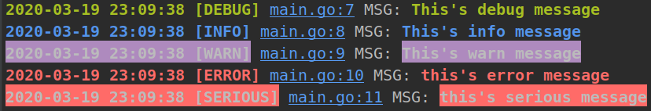

## logger 简介 

支持 linux 系统使用 , Windows 需要关闭颜色

支持追加方式写入文件 , 保持到磁盘

可以监视日志文件的大小 , 自动建立新的日志文件 , 默认最大存储 1M 

在`goland` IDE 中可快速定为到打印的行数


## 安装

```shel
go get -v -u github.com/eliot-jay/logger
```

##	日志的等级:

一共有六个等级 , `打印时的等级要等于或者小于配置的等级时`才会输出消息

| 等级 | 配置 | 释义                                             | 控制台颜色 |
| ---- | ---- | ------------------------------------------------ | :--------: |
| 0    | SERI |可能有危险的严重错误,如:初始化,数据库连接错误等 |红色底|
| 0    | Fatal | 致命错误,将会停止程序 |红色底|
| 1    | ERRO |普通错误,断言失败,类型转换失败等   						 |红色|
| 2    | WARN | 普通警告，比如权限出错，访问异常等               |紫色底|
| 3    | INFO | 重要消息                   									 |蓝色 |
| 4    | DBUG | 调试消息                                    |绿色|

####	Goland IDE的效果



**如:** 在`goland` IDE 中点击 `main.go:10` 可快速`跳转`到打印消息的行数


#### Linux 终端的效果

终端的效果是不同的 , 因为配色方案的结果 , 终端代码的行数无法进行跳转 , 默认颜色为`浅蓝色`**+** `下划线 `


##	简单使用:

```go
package test
import "github.com/eliot-jay/logger"

func main () {

	log := register.NewDefaultLogger()
	defer log.Destroy()
	log.Debug("hello world")
	log.Info("Info")
	log.Warn("Warn")
	log.Error("Error")
	log.Serious("Serious")
  
}
```

####	yaml文件中获取配置:

```go
package main

import "github.com/eliot-jay/logger"

func main() {
	log ,err := register.NewLogger("./config.yaml")
	if err!=nil{
		panic(err)
	}
	defer log.Destroy()
	log.Debug("hello world")
	log.Info("Info")
	log.Warn("Warn")
	log.Error("Error")
	log.Serious("Serious")  
}
```

#### yaml文件的配置

```yaml
# 日志打印的配置
loggerConfigure:
  level: "DBUG"    # 日志的等级: debug , info , warn , error , serious , fatal
  on-color: true   # 开启颜色
  on-write: true   # 开启日志文件记录
  on-console: true  # 开启控制台打印
  max-size: 1       # 日志文件最大存储的大小  单位: 1M
  identifier: ""    # 日志输出的标识符

  normal-file: "./logs/project.inf.1.log" # 正常日志的保存路径
  error-file: "./logs/project.err.1.log"  # 错误日志的保存路径
  time-format: "2006-01-02 15:04:05"      # 日志的时间格式

```


##	支持的时间格式

```
ANSIC           "Mon Jan _2 15:04:05 2006"
UnixDate      	"Mon Jan _2 15:04:05 MST 2006"
RubyDate     	"Mon Jan 02 15:04:05 -0700 2006"
RFC822          "02 Jan 06 15:04 MST"
RFC822Z         "02 Jan 06 15:04 -0700"
RFC850      	"Monday, 02-Jan-06 15:04:05 MST"
RFC1123         "Mon, 02 Jan 2006 15:04:05 MST"
RFC1123Z        "Mon, 02 Jan 2006 15:04:05 -0700"
RFC3339         "2006-01-02T15:04:05Z07:00"
RFC3339Nano     "2006-01-02T15:04:05.999999999Z07:00"
Kitchen         "3:04PM"
Stamp        	"Jan _2 15:04:05"
StampMilli    	"Jan _2 15:04:05.000"
StampMicro    	"Jan _2 15:04:05.000000"
StampNano     	"Jan _2 15:04:05.000000000"
RFC3339Nano1   	"2006-01-02 15:04:05.999999999 -0700 MST"
DEFAULT         "2006-01-02 15:04:05"
```
